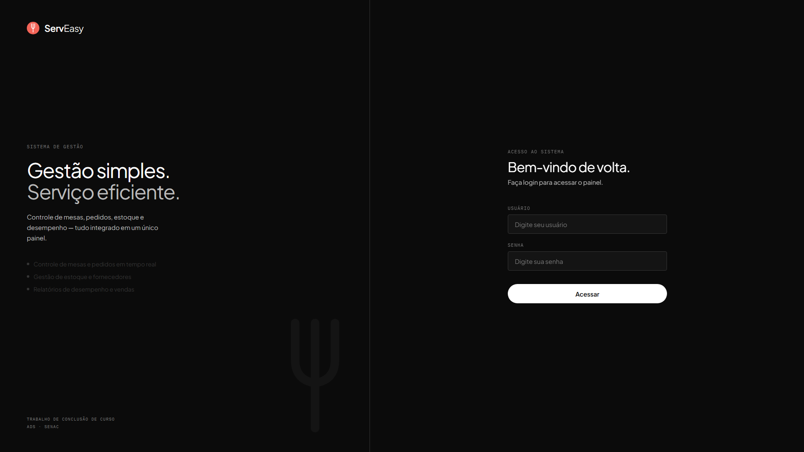

<div align="center">


# ServEasy - Restaurant Management System

<p align="center">
  <em>Final Course Project - Technical Course in Systems Analysis and Development</em><br/>
  <strong>SENAC - National Service for Commercial Learning</strong>
</p>

<p align="center">
  
  
  
  
</p>

</div>

---

## About the Project

**ServEasy** is a complete restaurant management system developed as a **Final Course Project** for the **Technical Course in Systems Analysis and Development at SENAC**. The system offers an integrated solution to manage all operational aspects of a restaurant, from table and order control to inventory management and performance analysis.

### Objective

Facilitate daily restaurant management through an intuitive and modern interface, optimizing operational processes and improving the experience for both employees and customers.

### Academic Context

This project was developed as a technical course final project, applying concepts of:
- Software Engineering
- Full-Stack Web Development
- Relational Database
- MVC Architecture
- RESTful API
- Authentication and Authorization
- Containerization with Docker

---

## System Demonstration


### Screenshots

<p align="center">
  
  
</p>

<p align="center">
  
  
</p>

---

## Technologies Used

<table>
  <tr>
    <td valign="middle"><strong>Backend</strong></td>
    <td>
       
      
      
      
      
    </td>
  </tr>
  <tr>
    <td valign="middle"><strong>Frontend</strong></td>
    <td>
      
      
      
      
    </td>
  </tr>
  <tr>
    <td valign="middle"><strong>Database</strong></td>
    <td>
      
      
    </td>
  </tr>
  <tr>
    <td valign="middle"><strong>DevOps</strong></td>
    <td>
      
      
      
    </td>
  </tr>
</table>

---

## Main Features

### Authentication System
- **Secure login** with JWT (JSON Web Tokens)
- **3 access levels**: Admin, Cook, Waiter/Customer
- **Permission control** by role

### Order Management
- **Create orders** by table
- **Status management**: New → In Progress → Ready → Delivered
- **Order cancellation** with logging
- **Custom notes** per order
- **Real-time tracking**

### Table Control
- **Table status**: Available, Occupied, Reserved, Maintenance
- **Configurable capacity**
- **Real-time visualization**
- **Occupancy history**

### Digital Menu
- **6 categories**: Appetizers, Main Courses, Pizzas, Snacks, Beverages, Desserts
- **Complete item management**
- **Availability control**
- **Prices and descriptions**
- **Image support**

### Inventory Management
- **Ingredient control**
- **Low stock alerts**
- **Relationship** ingredients → dishes
- **Suppliers** and expiration dates
- **Total value calculation**

### Kitchen Panel
- **View new orders**
- **Orders in progress**
- **Mark orders as ready**
- **Optimized interface** for preparation

### Administrative Dashboard
- **Sales statistics**
- **Orders by period**
- **Feedback analysis**
- **Real-time data visualization**
- **Performance reports**

### Financial Control
- **Sales records**
- **Transaction history**
- **Payment methods**: Cash, PIX, Card
- **Tracked cancelled orders**

### Feedback System
- **Ratings from 1 to 5 stars**
- **Customer comments**
- **Link with orders**
- **Satisfaction analysis**

---

## Installation and Execution

### Prerequisites

- **Docker** and **Docker Compose** installed
- **Port 8080** available (application)
- **Port 3307** available (MySQL)

### Option 1: Run with Docker (Recommended)

```bash
# 1. Clone the repository
git clone https://github.com/TiagoPortilho/ServEasy.git
cd ServEasy

# 2. Start containers
docker-compose up --build -d

# 3. Wait for initialization (about 1-2 minutes)
# Application will be available at http://localhost:8080
```

### Option 2: Run Locally

```bash
# 1. Clone the repository
git clone https://github.com/TiagoPortilho/ServEasy.git
cd ServEasy

# 2. Configure MySQL (port 3306)
# Create database 'serveasy_db'

# 3. Configure properties
# Edit src/main/resources/application.properties

# 4. Run with Maven
./mvnw spring-boot:run

# Or build and run
./mvnw clean package
java -jar target/ServEasy-0.0.1-SNAPSHOT.jar
```

### Populate Database with Demo Data

```bash
# Run the sample SQL script
Get-Content seed_data.sql | docker exec -i serveasy-mysql mysql -uapp_user -papp_pass serveasy_db
```

---

## Access Credentials

The system automatically creates 3 users for testing:

| Profile | Username | Password | Permissions |
|---------|----------|---------|-------------|
| **Administrator** | `admin` | `admin123` | Full system access |
| **Cook** | `cozinheiro` | `cozinha123` | Manage kitchen orders |
| **Waiter** | `atendente` | `atende123` | Create orders, view menu |

**Access URL:** http://localhost:8080/login

---

## Project Structure

```
ServEasy/
├── src/
│   ├── main/
│   │   ├── java/com/tiagoportilho/ServEasy/
│   │   │   ├── config/           # Configurations (Security, CORS)
│   │   │   ├── controller/       # REST and View Controllers
│   │   │   ├── dto/              # Data Transfer Objects
│   │   │   ├── exception/        # Exception handling
│   │   │   ├── model/            # JPA Entities
│   │   │   ├── repository/       # JPA Repositories
│   │   │   ├── security/         # JWT, Authentication
│   │   │   ├── service/          # Business logic
│   │   │   └── util/             # Utilities
│   │   └── resources/
│   │       ├── static/           # CSS, JS, Assets
│   │       │   ├── scripts/      # JavaScript by role
│   │       │   └── styles/       # CSS by role
│   │       ├── templates/        # Thymeleaf Templates
│   │       │   ├── admin/        # Admin Views
│   │       │   ├── cliente-atendente/  # Waiter Views
│   │       │   └── cozinheiro/   # Kitchen Views
│   │       └── application*.properties  # Configurations
│   └── test/                     # Unit tests
├── docker-compose.yml            # Docker orchestration
├── Dockerfile                    # Application build
├── pom.xml                       # Maven dependencies
├── database_init.sql             # Initial schema
├── seed_data.sql                 # Sample data
└── migration_*.sql               # Migration scripts
```

---

## API Documentation

Interactive API documentation is available via **Swagger UI**:

**URL:** http://localhost:8080/swagger-ui.html

### Main Endpoints

```
Authentication
POST   /api/auth/login          # User login

Orders
GET    /api/orders              # List orders
POST   /api/orders              # Create order
PUT    /api/orders/{id}/status  # Update status
DELETE /api/orders/{id}         # Cancel order

Menu
GET    /api/menu-items          # List menu
POST   /api/admin/menu-items    # Add item
PUT    /api/admin/menu-items/{id}  # Edit item
DELETE /api/admin/menu-items/{id}  # Remove item

Tables
GET    /api/tables              # List tables
POST   /api/admin/tables        # Add table
PUT    /api/tables/{id}/status  # Update status

Stock
GET    /api/admin/stock         # List stock
POST   /api/admin/stock         # Add item
PUT    /api/admin/stock/{id}    # Edit item

Feedbacks
GET    /api/feedbacks           # List feedbacks
POST   /api/feedbacks           # Send feedback

Dashboard
GET    /api/admin/dashboard/stats  # General statistics
```

---

## Database

### Data Model

The system uses **MySQL 8.0** with the following main tables:

- **users** - System users
- **tables** - Restaurant tables
- **menu_items** - Menu items
- **stock_items** - Stock items
- **menu_item_ingredients** - Relationship menu ↔ stock
- **orders** - Orders
- **order_items** - Order items
- **feedbacks** - Customer reviews
- **sales** - Sales records

### Migrations

The project includes versioned migration scripts:

1. `migration_orders_table_fk.sql` - FK between orders and tables
2. `migration_sales_table.sql` - Creation of sales table
3. `migration_sales_add_cancelled_orders.sql` - Addition of cancellations
4. `migration_stock_items.sql` - Stock improvements

---

## System Workflow

### 1. Waiter Flow
```
Customer arrives → Waiter marks table as OCCUPIED
                → Waiter creates order (selects items)
                → Order goes to kitchen (status: NEW)
```

### 2. Kitchen Flow
```
NEW Order → Cook views
         → Cook starts preparation (status: IN_PROGRESS)
         → Preparation finished (status: READY)
```

### 3. Delivery Flow
```
READY Order → Waiter picks up order
           → Waiter delivers to table (status: DELIVERED)
           → Table released (status: AVAILABLE)
           → Sale record created
```

---

## Tests

```bash
# Run all tests
./mvnw test

# Run with coverage
./mvnw test jacoco:report
```

---

## Useful Docker Commands

```bash
# Start containers
docker-compose up -d

# View application logs
docker logs serveasy-app -f

# View MySQL logs
docker logs serveasy-mysql -f

# Stop containers
docker-compose down

# Stop and clean volumes
docker-compose down -v

# Restart only the application
docker-compose restart spring-app

# Access MySQL
docker exec -it serveasy-mysql mysql -uapp_user -papp_pass serveasy_db
```

---

## Troubleshooting

### Problem: Port 8080 already in use
```bash
# Windows
netstat -ano | findstr :8080
taskkill /PID <PID> /F

# Linux/Mac
lsof -i :8080
kill -9 <PID>
```

### Problem: MySQL container doesn't start
```bash
# Clean volumes and restart
docker-compose down -v
docker-compose up --build
```

### Problem: Authentication error
```bash
# Check if default users were created
docker exec -it serveasy-mysql mysql -uapp_user -papp_pass serveasy_db -e "SELECT username, role FROM users;"
```

---

## Developer

**Tiago Portilho**  
Technical Course in Systems Analysis and Development - SENAC  
[GitHub](https://github.com/TiagoPortilho) | [LinkedIn](https://linkedin.com/in/tiagoportilho)

---

## License

This project was developed for **academic purposes** as a Final Course Project.

**© 2026 Tiago Portilho - SENAC**

---

## Acknowledgments

- **SENAC** - For technical training and support during development
- **Teachers and advisors** - For shared knowledge
- **Classmates** - For support and collaboration
- **Open Source Community** - For technologies and tools used

---

<div align="center">

**If this project was useful to you, consider giving the repository a star!**

</div>
